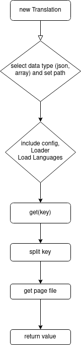

- [PHP Translation](#php-translation)
  - [Install](#install)
  - [Lifecycle](#lifecycle)
  - [Configuration](#configuration)
      - [Content of PHP File](#content-of-php-file)
      - [Content of Json File](#content-of-json-file)
      - [Content Of Database Table](#content-of-database-table)
- [Use Of](#use-of)
  - [Array Or Json](#array-or-json)
  - [Database](#database)
# PHP Translation
It is a php package that enables multi-language capability very easily. Also, the package accepts formats as `array`, `json` and `Database`.
## Install 
```bash
    composer require ahmetbarut/translation
```

## Lifecycle


## Configuration
The directory structure of the language files should be as follows and it should return an array. The location of the directory is not important, but the content is!

---
- lang
  - en
    - menu.php / menu.json
  - tr
    - menu.php / menu.json
  - de
    - menu.php / menu.json
---
#### Content of PHP File
```php
    return [
    'home' => 'Home',
];
```
#### Content of Json File
```json
    {
        "home": "Home",
        "deneme": "TEST"
    }
```

#### Content Of Database Table
You can change the table name as you wish. If the table name is different, you must give the table name to the `$table` parameter in the constructor of the `Translation` class.
```sql
CREATE TABLE translation (
    id serial PRIMARY KEY,
    key varchar (255),
    value VARCHAR (255),
    language VARCHAR(255)
    )
```

# Use Of
## Array Or Json
```php
use ahmetbarut\Translation\Translation;

require "./vendor/autoload.php";

$translation = new Translation(__DIR__ . '/lang', 'array');
$translation->setLocale('en');

trans('menu.home')
```
The `trans` function accepts a `string` and the first word before the period represents the file, and the word after the period is the key to the requested value.

The `setLocale` method also belongs to the `Translation` class.

## Database 

```php
use ahmetbarut\Translation\Translation;

require "./vendor/autoload.php";

try {
    $connect = new PDO('pgsql:host=localhost;dbname=translation;', 'ahmetbarut', "");
}catch (PDOException $th){
    die($th->getMessage());
}

$translation = new Translation( format: 'db', connect: $connect, table: 'translation_words');
$translation->setLocale('en');

trans('home')
```
The `trans` function does not expect `.` in this case.