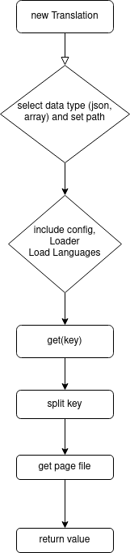

# PHP Translation
Çoklu dil desteğini çok kolay şekilde yapılandırıp kullanmanıza olanak sağlayan bir php paketi. Ayrıca paket hem `array` hemde `json` olarak format kabul ediyor.

## Kurulum 
```bash
    composer require ahmetbarut/translation
```

## Yaşam Döngüsü


## Yapılandırma
Dil dosyalarının dizin yapısı şu şekilde olmalıdır ve geriye dizi döndürmelidir. Dizinin yeri önemli değil ama içeriği önemli!
---
- lang
  - en
    - menu.php / menu.json
  - tr
    - menu.php / menu.json
  - de
    - menu.php / menu.json
---
#### PHP Dosyasının İçeriği
```php
    return [
    'home' => 'Home',
];
```
#### Json Dosyasının İçeriği
```json
    {
        "home": "Home",
        "deneme": "TEST"
    }
```
Şimdi kullanım:
```php
use ahmetbarut\Translation\Translation;

require "./vendor/autoload.php";

$translation = new Translation(__DIR__ . '/lang', 'array');
$translation->setLocale('en');

trans('menu.home')

```
`trans` fonksiyonu `string` kabul eder ve noktadan önceki ilk kelime dosyayı temsil eder, noktadan sonraki kelime de istenen değerin anahtarı.

`setLocale`, yöntemi de `Translation` sınıfına aittir.